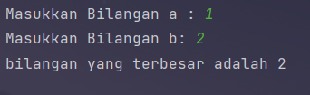
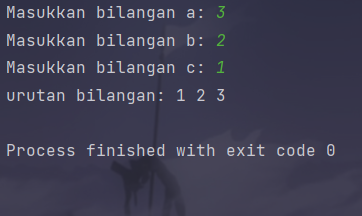
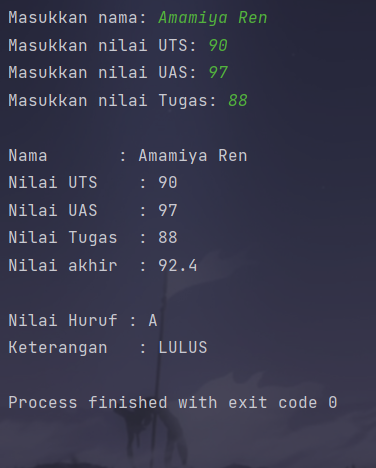
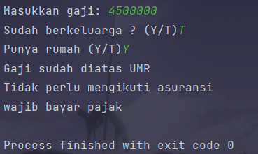
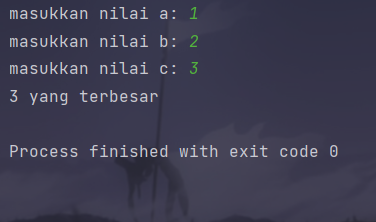
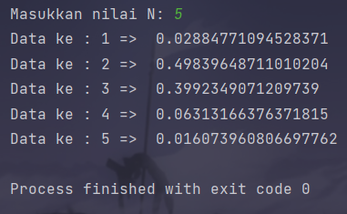
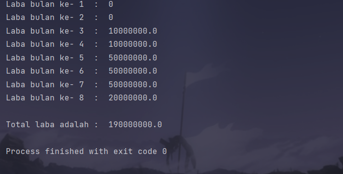

Nama: Alif Nur Fathlii Amarta

NIM: 312210326

Kelas: TI.22.A3

---

# Lab 2: Struktur Kondisi

### Latihan 1

---

Pertama tama input terlebih dahulu angka nya 

    a = int(input("Masukkan Bilangan a : "))
    b = int(input("Masukkan Bilangan b: "))

Lalu tentukan dengan ```statement if```

    if a > b:
        print ("Bilangan yang terbesar adalah",a)

    else :
        print ("bilangan yang terbesar adalah",b)

maka akan menampilkan angka yang terbesar dari 2 bilangan



### Latihan 2

---

Input 3 angka terlebih dahulu

    a = int(input("Masukkan bilangan a: "))
    b = int(input("Masukkan bilangan b: "))
    c = int(input("Masukkan bilangan c: "))

Urutkan angka nya dimulai dari kecil dengan menggunakan _statement_```if```

```
if a<b and a<c:
    if b<c:
        print ("urutan bilangan:",a,b,c)
    else:
        print("urutan bilangan:",a,c,b)

elif b<a and b<c:
    if a<c:
        print("urutan bilangan:",b,a,c)
    else:
        print("urutan bilangan:",b,c,a)

else:
    if a<b:
        print("urutan bilangan",c,a,b)
    else:
        print("urutan bilangan:",c,b,a)
```

Maka hasilnya akan seperti ini



---

## Praktikum 2

### Latihan 1 

Masukkan nama,kelas,nilai UTS,Nilai UAS dan Nilai Tugas

```
nama = input ("Masukkan nama: ")
uts = int(input("Masukkan nilai UTS: "))
uas = int(input("Masukkan nilai UAS: "))
tugas = int(input("Masukkan nilai Tugas: "))
```

Buatlah nilai akhir dan keterangannya

```
akhir = ( tugas * .2) + (uts * .4) + (uas * .4)
keterangan = ("TIDAK LULUS", "LULUS")[akhir > 75.0]
```

Buat rank nilai nya dengan _statement ```if```_
```
if akhir > 80:
    huruf = "A"
elif akhir > 70:
    huruf = "B"
elif akhir > 50:
    huruf = "C"
elif akhir > 40:
    huruf = "D"
else:
    huruf = "E"
```

_print_ Nama,Kelas,dll. nya

Hasilnya akan seperti ini



### Latihan 2 

Masukkan Gaji dan status lainnya 

```
gaji = int(input("Masukkan gaji: "))
berkeluarga = (False,True)[input("Sudah berkeluarga ? (Y/T)") == "Y"]
punya_rumah = (False,True)[input("Punya rumah (Y/T)") == "Y"]
```

Gunakan ```if``` untuk menampilkan status jika sudah wajib UMR,dll.

```
if gaji > 3000000:
    print ("Gaji sudah diatas UMR")
    if berkeluarga:
        print("Wajib mengikuti asuransi dan menabung untuk pensiun ")

    else:
        print("Tidak perlu mengikuti asuransi")

    if punya_rumah:
        print("wajib bayar pajak")
    else:
        print("Tidak wajib bayar pajak")

else:
    print("Gaji belum UMR")
```

Maka hasilnya



### Latihan 3

_Input_ 3 bilangan

```
a = int(input("Masukkan bilangan A: "))
b = int(input("Masukkan bilangan B: "))
c = int(input("Masukkan bilangan C: "))
```

Gunakan ```if``` untuk membandingkan 3 input bilangan, apabila penjumlahan 2 bilangan hasilnya
sama dengan bilangan lainnya, maka akan keluar pernyataan “BENAR”

```
if a+b == c or b+c == a or c+a == b:
    print("BENAR")
else:
    print("SALAH")
```


### Tugas Praktikum 2

_input_ 3 bilangan

``` 
a = int(input("masukkan nilai a: "))
b = int(input("masukkan nilai b: "))
c = int(input("masukkan nilai c: "))
```

lalu tentukan bilangan terbesar diantara ketiganya menggunakan _Statement_ ```if```

```
if a>b and a>c:
    print(a,"yang terbesar")
elif b>a and b>c:
    print(b,"yang terbesar")
else:
    print(c,"yang terbesar")
```



---

# Lab 3: Perulangan

### Latihan 1

Buat baris dan kolom dengan for 
``` 
for baris in range (0,10):
    for kolom in range (0,10):
        print(f"{baris+kolom:>3}", end = '')
    print('')
```

hasilnya akan menjadi


### Latihan 2

import ```random()``` dan input nilai nya terlebih dahulu

    import random
    n = int(input("Masukkan nilai N: "))

gunakan ```for``` dan ```random.uniform``` 

``` 
for i in range (n):
    a = random.uniform(0.0,0.5)
    print("Data ke :",i+1,"=> ",a)
```

maka hasilnya menjadi 


---

## Praktikum 3 

### Latihan 1
``` 
import random
n = int(input("Masukkan nilai N: "))

for i in range (n):
    a = random.uniform(0.0,0.5)
    print("Data ke :",i+1,"=> ",a)
```


### Latihan 2

Gunakan ```while``` untuk melakukan perintah program nya 
 ```
 x = 0

while True:
    n=int(input("masukkan bilangan: "))
    if x < n:
        x = n
    if n == 0:
        break
print("bilangan terbesar adalah ",x)
 ```
program otomatis akan tetap berjalan hingga kita meng-inputkan angka 0 



### Praktikum 3

Gunakan ```for``` untuk menghitung laba nya

masukkan modal awal nya yaitu 100 juta

    x = 100000000

lalu masukkan _statement_ for dan if untuk menghitung laba nya selama 8 bulan
```
for a in range(1,9):
    if(a>=1 and a<=2):
        b = x * 0
        print("Laba bulan ke-",a," : ",b)
    if(a>=3 and a<=4 ):
        c = x * 0.1
        print("Laba bulan ke-",a," : ",c)
    if(a>=5 and a<=7):
        d = x * 0.5
        print("Laba bulan ke-",a," : ",d)
    if(a==8):
        e = x*0.2
        print("Laba bulan ke-",a," : ",e)
```

Bulan 1 dan 2 tidak mendapatkan laba jadi programnya adalah
```
 if(a>=1 and a<=2):
        b = x * 0
        print("Laba bulan ke-",a," : ",b)
```
Bulan 3 mendapatkan laba sebesar 1% 
``` 
 if(a>=3 and a<=4):
        c = x * 0.1
        print("Laba bulan ke-",a," : ",c)
```
Bulan ke 5 mendapatkan laba sebesar 5%
``` 
 if(a>=5 and a<=7):
        d = x * 0.5
        print("Laba bulan ke-",a," : ",d)
```
Bulan ke 8 turun 2%
```
if(a==8):
        e = x*0.2
        print("Laba bulan ke-",a," : ",e)
```
Totalkan semua nya 

``` 
total=b+b+c+c+d+d+d+e
print("\nTotal laba adalah : ",total)
```

maka hasilnya



selama 8 bulan totalnya adalah 190 juta 
